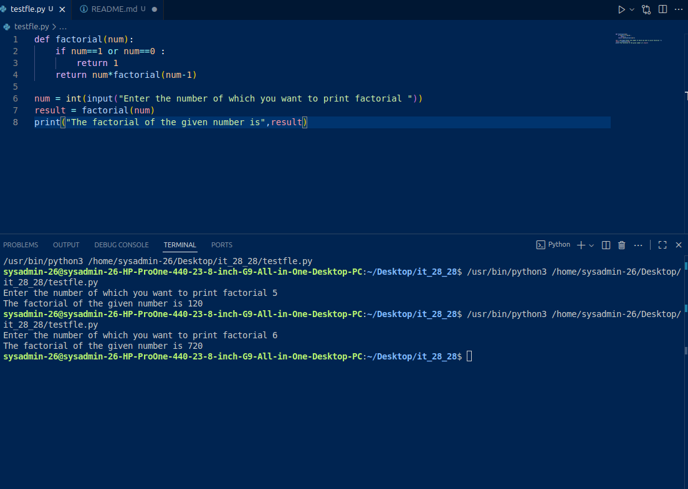

Title :- 
This is a quite basic python code which can get user the factorial of the number of there choice
it can be used to save time manually finding the factorial by just using few lines of code and output 

How to you use this :- 
   1. you should download all the files and then save them locally in your pc or any computer that you have
   2. You should which python version you if you have any valid python version then it should be good enough 
      to run properly 
   3. Then you should run the file using any ide with python extension 
   4. Then enter your choice number and then code will give you your desired output

Test :- 
